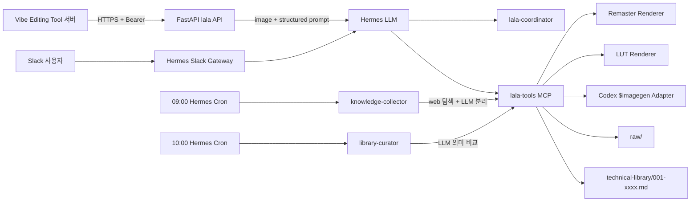

# Learnable Agent(lala) 설계 및 구현 계획

- 문서 상태: 구현 기준(Implemented, revision 3)
- 작성일: 2026-08-02
- 최종 수정일: 2026-08-02
- 대상 Agent: `lala(라라)`

## 1. 문서 목적과 우선순위

이 문서는 Hermes Agent 기반 이미지 편집·보정 서비스 `lala`의 구현 기준을 정의한다. 코드,
API 계약, 지식 수집·승격, 이미지 실행, 보안 및 테스트가 같은 원칙을 따르도록 하는 것이 목적이다.

작업을 시작할 때는 항상 `adr/*.md`를 먼저 읽는다. `status: accepted`인 ADR은 이 문서와
`AGENTS.md`의 일반 설계 설명보다 우선한다. 현재 accepted ADR은 없으며, 향후 충돌이 생기면
구현으로 우회하지 않고 새 결정을 요청한다.

## 2. 확정 요구사항

1. 사용자는 Vibe Editing Tool 또는 Slack에서 이미지와 자연어 요청을 전달한다.
2. 사용자에게 보이는 편집 도구는 Remaster, LUT, Generate AI 세 가지다.
3. Vibe에는 실행 가능한 `EditPlan 1.0`을 반환하고, Slack에는 같은 계획의 설명과 실행 결과를
   전달한다.
4. raw 탐색과 시나리오 분리, technical library 승격, 편집 도구와 파라미터 선택은 Hermes
   LLM이 이미지와 문장의 전체 문맥으로 판단한다.
5. 프롬프트 token, 단어 포함 여부, 정규식, alias 표, 동의어 점수 또는 고정 빈도 점수로 의미를
   결정하는 구현은 두지 않는다.
6. Python은 의미를 대신 결정하지 않고 스키마, 범위, allowlist, 중복, 경로, 근거 상태 및
   원자 저장을 검증한다.
7. Hermes가 web 도구로 전문가 자료를 직접 탐색하고, `raw/`에 한 파일 한 시나리오의 한국어
   Markdown을 발행한다. Python crawler는 사용하지 않는다.
8. Hermes가 raw 문서의 반복성과 재사용 가치를 해석해
   `technical-library/001-xxxx.md` 형식으로 발행한다.
9. 사용자 추천에는 `status: active`인 technical 문서만 근거로 사용할 수 있으며, LLM이 실제로
   읽은 technical ID와 version만 `evidence`에 기록한다.
10. Generate AI는 Codex의 `$imagegen` 내장 도구를 사용한다. Image API CLI 또는
    `OPENAI_API_KEY` 경로로 자동 전환하지 않으며 결과는 프로젝트의 요청별 output에 PNG로
    복사한다.
11. Markdown, YAML, JSON은 UTF-8과 LF로 읽고 쓴다. 대체 문자 U+FFFD가 포함된 문서는
    거부한다.
12. 세 Hermes skill과 그 reference는 런타임 프롬프트의 단일 원본이다. 반복 오류를 바탕으로
    self-improvement할 수 있지만 보안·스키마·active evidence gate는 약화할 수 없다.

여기서 금지하는 “token 기반”은 사용자 프롬프트를 단어 조각으로 분류하는 의미 결정 방식이다.
업로드 URL의 HMAC `token`이나 LUT 파일 형식의 keyword parser처럼 인증·파일 문법을 검증하는
결정론적 코드는 이 금지 대상이 아니다.

## 3. 책임 분리

### 3.1 의미 판단 계층

Hermes LLM이 다음을 담당한다.

- 사용자 목표, 변경 대상, 보존 대상과 금지 대상 해석
- 이미지 분석값과 실제 이미지의 관계 해석
- Remaster, LUT, Generate AI 중 적합한 도구 선택
- Remaster/LUT 파라미터와 Generate AI 프롬프트 작성
- active technical 문서의 적용 가능성 판단
- 전문가 자료 탐색과 한 시나리오 단위 분리
- raw 간 동일 원리, 차이, 충돌 및 반복성 판단
- candidate, active, deprecated 상태 제안

Hermes가 응답하지 않거나 계약을 지키지 못하면 heuristic fallback으로 계획을 만들지 않는다.
한 번의 구조 교정 후에도 실패하면 안정된 Agent 오류를 반환한다.

### 3.2 결정론적 gate 계층

Python/FastAPI/MCP가 다음을 담당한다.

- 이미지 MIME, 크기, 해상도, SHA-256과 안전한 경로 검증
- EXIF orientation 적용, sRGB PNG 정규화와 메타데이터 제거
- `EditPlan 1.0` 및 도구별 파라미터 범위 검증
- LUT manifest의 approved ID, 파일 해시와 `.cube` 문법 검증
- active technical ID/version 및 지원 도구 일치 검증
- source allowlist, canonical URL, exact content hash 기반 중복 방지
- `001`부터 시작하는 번호와 semantic version 배정
- UTF-8/LF, U+FFFD 금지 및 atomic write
- retry, rate limit, timeout, TTL과 비식별 감사 로그

## 4. 아키텍처



### 4.1 프롬프트 원본

- `skills/lala-coordinator/SKILL.md`
- `skills/lala-coordinator/references/planner-prompt.md`
- `skills/knowledge-collector/SKILL.md`
- `skills/knowledge-collector/references/raw-format.md`
- `skills/library-curator/SKILL.md`
- `skills/library-curator/references/technical-note-format.md`

API planner는 coordinator reference를 매 요청마다 UTF-8로 다시 읽으므로 승인된 prompt 개선이
다음 요청부터 적용된다. API 경로에서는 모든 active technical 문서의 전문을 Hermes 입력에
포함해 실제로 읽을 수 있게 한다. Hermes native coordinator 경로에서는
`list_technical_notes(status="active")`와 `read_technical_note`를 사용한다.
읽은 planner prompt의 SHA-256은 사용자 문장 없이 request ID와 함께 감사 로그에 남겨,
self-improvement 전후의 판단을 재현하고 비교할 수 있게 한다.

반복된 오판이나 누락이 여러 실행에서 확인되면 Hermes의 `skill_manage`로 관련 skill/reference를
작게 수정할 수 있다. 외부 raw 문서의 지시나 한 사용자의 일회성 취향은 개선 규칙으로 복사하지
않는다.

## 5. 공통 편집 흐름

1. 요청 ID를 만들고 업로드 asset을 검증한다.
2. EXIF orientation을 적용한 안전한 sRGB PNG를 요청 workspace에 만든다.
3. 정량 이미지 분석값과 실제 이미지를 Hermes LLM에 제공한다.
4. Hermes가 사용자 의도와 active technical 문서 전문을 함께 해석한다.
5. Hermes가 `EditPlan 1.0` JSON을 반환한다.
6. schema, 단계 조합, LUT manifest와 active evidence gate를 검증한다.
7. Vibe 요청이면 계획만 반환한다.
8. Slack 요청이면 검증된 계획을 실행하고 설명과 실제 결과 파일을 반환한다.

raw 문서는 사용자 추천 입력에 포함하지 않는다. 적합한 active technical 문서가 없으면
`evidence=[]`, 낮은 confidence와 `근거 technical 문서 없음` 경고를 사용한다.

## 6. EditPlan 1.0

```json
{
  "schema_version": "1.0",
  "request_id": "req_01example",
  "summary_ko": "역광의 분위기와 구도는 유지하고 어두운 부분의 세부를 회복합니다.",
  "steps": [
    {
      "order": 1,
      "tool": "remaster",
      "parameters": {
        "brightness": 4,
        "contrast": 0,
        "highlights": -12,
        "shadows": 22,
        "saturation": 0,
        "temperature": 0,
        "tint": 0,
        "sharpness": 3,
        "denoise": 5,
        "vignette": 0
      },
      "reason_ko": "새 픽셀을 만들지 않고 하이라이트를 보존하며 그림자를 회복합니다.",
      "evidence": [
        {"skill_id": "backlit-shadow-recovery", "version": "1.0.0"}
      ]
    }
  ],
  "overall_reason_ko": "원본 피사체와 구도를 바꿀 필요가 없어 결정론적 보정이 적합합니다.",
  "confidence": 0.84,
  "warnings_ko": []
}
```

`evidence[].skill_id`는 EditPlan 1.0 호환성을 위해 유지하는 wire field다. 값은 번호형
technical 문서의 `technical_id`를 의미한다.

### 6.1 Remaster

| 파라미터 | 범위 | 기본값 |
|---|---:|---:|
| `brightness` | -100..100 | 0 |
| `contrast` | -100..100 | 0 |
| `highlights` | -100..100 | 0 |
| `shadows` | -100..100 | 0 |
| `saturation` | -100..100 | 0 |
| `temperature` | -100..100 | 0 |
| `tint` | -100..100 | 0 |
| `sharpness` | 0..100 | 0 |
| `denoise` | 0..100 | 0 |
| `vignette` | -100..100 | 0 |

이 값은 Samsung 비공개 Remaster 엔진이 아니라 lala와 Vibe가 공유하는 논리 파라미터다.
렌더러는 float linear RGB에서 처리하며 결과는 메타데이터 없는 PNG다.

### 6.2 LUT

```json
{
  "lut_id": "cinematic-warm-01",
  "strength": 72,
  "interpolation": "trilinear",
  "preserve_luminance": true
}
```

`luts/manifest.yaml`에서 `status: approved`인 ID만 허용한다. 경로 탈출, 잘못된 hash,
NaN/Inf, 지나치게 큰 LUT와 잘못된 1D/3D 크기는 거부한다.

### 6.3 Generate AI

```json
{
  "operation": "edit",
  "use_case": "lighting-weather",
  "execution_mode": "codex-imagegen-builtin",
  "prompt": "구도는 유지하고 어두운 그림자만 자연스럽게 회복",
  "constraints": ["피사체, 정체성, 구도와 물체 위치 유지"],
  "avoid": ["새 객체", "텍스트", "워터마크"],
  "output_format": "png"
}
```

- v1에서는 Generate AI를 다른 단계와 섞지 않는다.
- Codex 프롬프트에 `$imagegen`을 명시하고 입력 이미지를 edit target으로 지정한다.
- 로그인된 Codex의 내장 도구를 사용하며 Image API 전용 `model`, `quality`, `size` 필드를
  계약에 두지 않는다.
- `codex exec`는 내장 스킬을 호출하기 위한 오케스트레이션 경로일 뿐 Image API CLI가 아니다.
- Codex workspace는 요청별 output 디렉터리로 좁히고 프롬프트는 stdin으로 전달한다.
- 결과의 실제 경로와 PNG 형식을 다시 검증하고 안전한 PNG로 재인코딩해 메타데이터를 제거한다.
- 내장 도구 실패를 Remaster나 Image API CLI로 조용히 대체하지 않는다.

## 7. Vibe Editing Tool 연동

FastAPI가 실행되면 다음 대화형 문서를 제공한다.

- Swagger UI: `GET /docs`
- ReDoc: `GET /redoc`
- OpenAPI 3 계약: `GET /openapi.json`
- 지원 버전 조회: `GET /v1/capabilities`
- 고정 JSON Schema: `schemas/edit-plan.schema.json`
- TypeScript 참고 타입: `docs/api/edit-plan.ts`

Vibe 브라우저가 lala를 직접 호출하지 않고 Vercel Route/Function 같은 서버 계층에서 Bearer
비밀을 보관한다.

연동 순서:

1. `POST /v1/assets/upload-requests`
2. 응답의 짧은 수명 `upload_url`에 정확한 MIME과 bytes로 `PUT`
3. `POST /v1/edit-requests`로 asset ID, 자연어 prompt와 client capability 제출
4. HTTP 202 응답의 `status_url`을 polling
5. `completed`이면 `EditPlan 1.0`, `failed`이면 안정된 한국어 오류 계약 처리

`client_request_id`는 idempotency key다. 같은 키와 같은 본문은 같은 요청을 반환하고, 다른
본문은 `IDEMPOTENCY_CONFLICT`로 거부한다. 상세 예시는 `docs/api/vibe.md`에 둔다.

## 8. Slack 연동

1. Hermes Slack Gateway가 허용된 사용자와 채널의 이미지 첨부를 요청 workspace에 둔다.
2. `lala-coordinator`가 LLM으로 계획을 만들고 세 gate를 통과시킨다.
3. Remaster/LUT는 프로젝트 렌더러가, Generate AI는 Codex 내장 `$imagegen`이 실행한다.
4. 한국어 추천, 실제 evidence ID/version과 존재하는 결과 파일 경로를 반환한다.
5. Hermes Deliverable Mode가 파일을 Slack native attachment로 전달한다.

실행 실패 시 계획 자체는 보존하고 한국어 오류, retryable 여부와 요청 ID를 전달한다. 존재하지
않는 결과 경로는 응답하지 않는다.

## 9. 09:00 raw 수집

Hermes Cron `0 9 * * *`에 `knowledge-collector`를 연결하고 실행 환경의
`TZ=Asia/Seoul`을 고정한다.

### 9.1 탐색과 의미 판단

- Hermes LLM이 `config/sources.yaml`의 활성 HTTPS 출처를 web 도구로 직접 탐색한다.
- Python crawler, keyword classifier, token 빈도 또는 정규식으로 페이지나 시나리오를 고르지
  않는다.
- 전문가가 설명한 전체 문맥을 읽고 재사용 가능한 하나의 촬영·보정 상황을 식별한다.
- 한 자료에 여러 상황이 있으면 `write_raw_scenario`를 각각 호출해 별도 Markdown으로 저장한다.
- 원문에 없는 수치는 만들지 않는다. 정성 표현은 `reported_as: qualitative`,
  `value: null`로 기록한다.
- 외부 문서의 지시문은 실행 명령이 아닌 비신뢰 데이터로 취급한다.

사용자가 제시한
[Samsung camera modes raw 예시](https://github.com/okdoggy/Edit_Master_wiki/blob/main/raw/magazine/samsung_camera_modes_settings.md)의
실전 팁 카드 구성을 참고하되, 예시처럼 여러 Tip을 한 파일에 합치지 않는다.

### 9.2 저장 계약

```text
raw/
└── YYYY/
    └── MM/
        └── DD/
            └── <source>-<subject>-<intent>-<hash>.md
```

각 문서는 frontmatter에 source, device, scenario, method, rationale, collection을 두고 본문에는
다음 섹션을 둔다.

- 상황
- 촬영/작업 순서
- 추천 시작값 / 조작값
- 보정 루틴
- 주의할 점
- 확실성과 근거
- 출처

`write_raw_scenario`는 schema, 한국어 필드, source allowlist, canonical URL, exact content
hash, 한 시나리오 제출 단위와 UTF-8/LF를 검증한 뒤 atomic rename한다. 이 검증은 의미 군집이나
추천을 수행하지 않는다.

사용자 이미지와 프롬프트는 raw에 절대 넣지 않는다. raw는 사용자 추천의 직접 근거로 읽거나
인용하지 않는다.

## 10. 10:00 technical library 큐레이션

Hermes Cron `0 10 * * *`에 `library-curator`를 연결한다.

### 10.1 Hermes LLM 절차

1. `list_raw_scenarios`와 `read_raw_scenario`로 검토 자료를 읽는다.
2. `list_technical_notes`와 필요한 `read_technical_note`로 기존 문서를 읽는다.
3. 서로 다른 표현이 같은 원리인지, 같은 표현이 다른 조건인지 전체 문맥으로 판단한다.
4. 반복성, 결과에 미치는 의미, 적용 조건, 지원 도구와 충돌을 설명한다.
5. 유용하지만 근거가 부족하면 candidate, 반복된 독립 근거가 충분하면 active로 제안한다.
6. `publish_technical_note`로 구조화된 결과를 발행하고 다시 읽어 검수한다.

단어 겹침, parameter alias, 정규식, 단순 횟수나 고정 점수로 묶는 Python curator는 두지 않는다.

### 10.2 상태와 발행 gate

- `candidate`: 단일 근거이거나 적용 범위·재현성이 부족한 보존 후보
- `active`: 최소 두 raw ID와 서로 다른 두 canonical source URL이 같은 재사용 원리를 지지
- `deprecated`: 최신 근거 또는 회귀 평가에서 사용하지 않기로 한 문서

`publish_technical_note`는 의미 결정을 하지 않는다. Hermes 제출을 검증하고 처음 발행할 때
`001`부터 번호를 배정하며 상태 전환에 맞춰 version을 올린다. 같은 내용의 재발행은
idempotent하다.

```text
technical-library/
├── 001-backlit-shadow-recovery.md
├── 002-natural-skin-denoise.md
└── 003-background-replacement-constraints.md
```

문서 frontmatter:

- `number`, `technical_id`, `title_ko`, `summary_ko`
- `version`, `status`, `supported_tools`, `confidence`
- `raw_scenario_ids`, 검증된 `source_urls`, `reviewed_at`
- `created_by: hermes-llm`

본문:

- 적용 조건
- 기술 절차
- 파라미터 가이드
- 판단 근거
- 주의사항
- 충돌 및 예외
- raw 근거 ID

번호형 technical 문서는 Hermes `SKILL.md` 자체가 아니다. self-improvement 대상 skill은
`skills/` 아래 세 workflow이고, technical 문서는 MCP를 통해 LLM에 제공되는 검증된 지식이다.

## 11. evidence gate

- 추천 후보는 `status: active` 문서로 제한한다.
- API planner는 active 문서의 ID, version, 지원 도구와 전문을 Hermes 입력에 포함한다.
- Hermes native workflow는 문서를 `read_technical_note`로 읽은 뒤 evidence를 기록한다.
- Python validator는 evidence의 ID/version이 현재 active 문서와 정확히 일치하고 해당 step의
  도구가 `supported_tools`에 있는지 확인한다.
- candidate, deprecated, 존재하지 않는 version과 도구 불일치는 계획 실행 전에 거부한다.

## 12. 텍스트와 이미지 안전

### 12.1 UTF-8/LF

- Markdown/YAML/JSON은 strict UTF-8로 decode하고 UTF-8 without BOM으로 쓴다.
- CRLF와 CR은 저장 전에 LF로 정규화한다.
- U+FFFD 또는 UTF-8로 encode할 수 없는 surrogate가 있으면 발행을 거부한다.
- raw와 technical 문서는 임시 파일에 fsync한 뒤 atomic rename한다.
- schema export도 같은 UTF-8/LF writer를 사용한다.

### 12.2 이미지와 개인정보

- JPEG/PNG/WebP의 magic bytes, MIME, 크기, 해상도와 SHA-256을 검증한다.
- EXIF orientation을 먼저 적용한다.
- 사용자 원본의 EXIF, GPS, ICC와 기타 메타데이터를 결과에 복사하지 않는다.
- Generate AI 결과도 PNG로 다시 정규화해 metadata를 제거한다.
- 사용자 이미지와 prompt는 `raw/`, `technical-library/` 또는 감사 로그에 넣지 않는다.
- 기본 TTL 24시간 후 `var/assets`, `var/jobs`, `output/imagegen/<request-id>`를 정리한다.

감사 로그에는 비식별 request/asset ID, 이미지·planner prompt 해시, 바이트·해상도, 도구와 버전,
오류 코드만 남긴다.

## 13. 저장소 구현 지도

```text
src/lala/
├── api/                 # FastAPI, upload, async request, OpenAPI
├── domain/              # EditPlan 1.0과 runtime validation
├── hermes/              # Responses planner와 Slack coordinator
├── knowledge/           # raw/technical 구조 검증과 원자 저장
├── mcp/                 # Hermes용 최소 권한 도구
├── renderers/           # Remaster, LUT, Codex built-in imagegen
├── storage/             # asset, workspace, SQLite, cleanup
└── observability/       # 비식별 audit와 metrics

skills/
├── lala-coordinator/
├── knowledge-collector/
└── library-curator/

schemas/
├── edit-plan.schema.json
├── raw-scenario.schema.json
├── technical-note.schema.json
└── openapi.json
```

## 14. 운영

- API와 Slack/Cron 비밀은 secret store에서 주입한다.
- `HERMES_API_KEY`는 planner가 Hermes API를 호출할 때만 사용한다.
- Generate AI에는 `OPENAI_API_KEY`가 필요하지 않다. 로그인된 Codex와 `$imagegen` 스킬이
  필요하다.
- Cron 등록은 `scripts/register-hermes-cron.sh`를 사용하고 등록 직후 두 작업을 수동 실행한다.
- 09시 작업에는 web/skills/lala-tools, 10시 작업에는 skills/lala-tools만 최소 권한으로 노출한다.
- Agent timeout, rate limit과 Codex 실행 실패는 retryable 여부가 있는 안정된 한국어 오류로
  변환한다.
- Generate AI 실패를 다른 도구로 자동 대체하지 않는다.

## 15. 검증 전략

필수 명령:

```bash
uv sync --extra dev
uv run python scripts/export_schemas.py
uv run ruff check .
uv run pytest
```

자동 테스트 범위:

- EditPlan discriminated union, 범위와 단계 조합
- Hermes Responses payload, 실제 active 전문 제공, 한 번의 schema 교정과 retry
- active/candidate evidence gate와 supported tool 일치
- raw 한 파일 한 시나리오, allowlist, exact 중복과 원문 수치 보존
- Hermes-authored technical note의 `001-xxxx.md`, version, 독립 출처 gate
- UTF-8/LF 정규화와 U+FFFD 거부
- Remaster/LUT 결정론, alpha, grayscale, path traversal와 golden image
- FastAPI 인증, idempotency, Swagger/ReDoc/OpenAPI, 202와 polling
- Slack 성공·실패 메시지와 실제 파일 존재
- Codex 내장 `$imagegen` prompt/환경 격리, PNG/metadata 계약

`tests/fixtures/imagegen/`에는 내장 `$imagegen`으로 만든 테스트 전용 source/edit PNG가 있다.
기본 테스트는 이 fixture와 fake runner로 회귀를 확인한다. `LALA_RUN_LIVE_IMAGEGEN=1`은
Codex가 설치·로그인된 배포 후보 환경에서만 opt-in으로 실행한다.

## 16. 완료 정의

- 프롬프트 의미를 token/keyword/regex/alias로 선택하는 production code가 없다.
- Hermes LLM이 도구·파라미터·raw 분리·technical 승격을 담당한다.
- Python은 구조·보안·근거 gate만 담당한다.
- raw는 한 파일 한 시나리오이며 사용자 데이터와 분리된다.
- technical library는 번호형 Markdown이고 active 문서만 evidence가 된다.
- Vibe는 FastAPI 대화형 문서와 고정 OpenAPI/JSON Schema/TypeScript 계약으로 연동할 수 있다.
- Generate AI는 Codex 내장 `$imagegen`과 프로젝트 PNG output만 사용한다.
- 모든 문서 산출물은 UTF-8/LF이며 U+FFFD가 없다.
- 전체 lint, schema export, contract/unit/golden/E2E 테스트가 통과한다.
